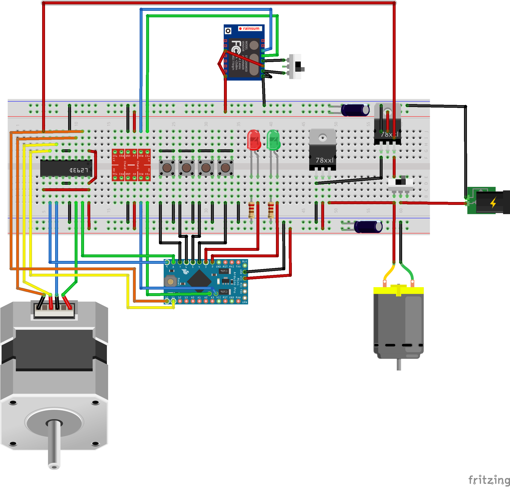

# Finger-Joint-Jig

This is the software and electronic-hardware design of my finger joint jig

## How to use it

Plug the jig to the power source

### How to access the virtual UI

 1. With you smart-phone, tablet, computer, etc. connect to the wifi signal named `WiFingerJointJig`, no password needed.
 2. Open a browser and go to [http://192.168.4.1](http://192.168.4.1)
 3. The setings page should load by itself
 4. Change the values and push submit, the page should reload and the jig is ready to be used

### How to use the physical UI

There are 3 buttons:

  - Next: move the jig to the next cutting spot
  - Home: move the jig to the home direction until the limit switch is activated
  - Previous: move the jig back to the last known position

## Software design

There are 3 main elements in this design:

  - A quadruple H-bridge (L293D) in charge of driving the stepper.
  - An Arduino Pro Mini (5V, 16MHz) in charge of the movement logic. It is connected by I2C as a slave to the ESP.
  - An ESP8266 in charge of serving the virtual UI and keeping the settings in EEPROM. This is the master in the I2C network.
 
The ESP and Arduino firmwares are quite self explanatory. You will be able to get the `ino` files at the root of this repo.

The HTML UI is embedded inside the ESP's firmware but you can modify it following those simple steps:

 1. Install `npm` and `grunt` (documentation: [https://gruntjs.com/](https://gruntjs.com/))
 2. Install the dependencies, run in a terminal at the root of the project: `nom install`
 3. Modify client.html as you wish.
 4. Run `grunt` in the same terminal.
 5. Copy the content of `generated/client.html` to `server.ino#sendWebPage`
 6. Save and upload your fimware to the ESP. `Rx`, `Tx` and `GND` are exposed via male headers as well as a programing rocker switch.
 
## Hardware design
 
I used [Fritzing](http://fritzing.org) to draw the electronic diagram (see breadboard below).

And [SketchUp](https://www.sketchup.com/) to draw the mechanic parts (see in the screenshot section).

## Feel free

If you want to reproduce, modify or enhance my variation of this jig, feel free to do it respecting the licence enclosed in this repo.

If you detect a bug or a possible enhancement to the code, feel free to send me a merge request, open an issue or leave a comment!

Thanks!

## Screenshots
 
 Virtual UI:
 
 
 
 Electronic design:
 
 

 Mechanic desing:
 
